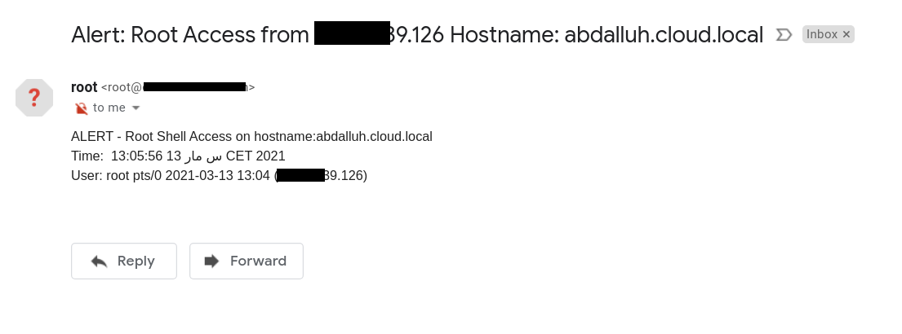

## SSH Login Alert
get email alert when anyone login via ssh into linux server 

# How to run
Open terminal and run below commands
``` 
git clone https://github.com/abdalluhmostafa/ssh-login-alert
cd ssh-login-alert
chmod +x sshalert.sh
vim alert.txt
Edit email to your mail
then run sshalert
./sshalert.sh

```

## Screenshots




